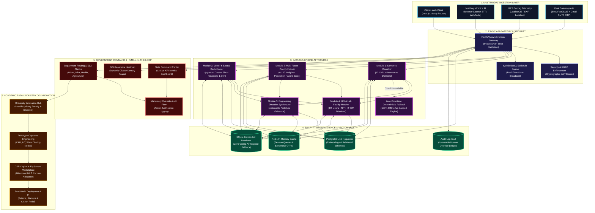

# 🛡️ SATARK AI — System for Automated Tracking, AI-assisted Routing & Knowledge-driven Action

<div align="center">


### **AI-Powered Civic Intelligence & Multi-Stakeholder Action Platform**
*Bridging Grassroots Communities, State Governance, Academic R&D, and CSR Capital into an Unbroken Pipeline of Rapid Public Problem Resolution.*

<br/>

[](https://www.sih.gov.in/)
[](https://www.sih.gov.in/)
[](https://jharkhand.gov.in/)
[](https://jharkhand.gov.in/)
[](#-dual-mode-resilience--air-gapped-readiness)
[](#-engineering-team--contributors)

<br/>

[](https://nextjs.org/)
[](https://fastapi.tiangolo.com/)
[](https://github.com/pgvector/pgvector)
[](#-security-cryptography--access-control)

<br/>

[📐 Architecture](#-system-architecture) • [✨ Key Pillars](#-core-pillars--technical-capabilities) • [🛠️ Tech Stack](#-technology-stack-matrix) • [⚡ Quick Start](#-quick-start-run-locally-in-2-minutes) • [🔑 Test Accounts](#-pre-configured-test-accounts--roles) • [🧭 Judge Walkthrough](#-evaluator--judge-walkthrough-guide) • [👥 Team](#-engineering-team--contributors)

---

</div>

## 🌐 Live Demonstrations & Production Portals

Experience the live deployed interfaces of **SATARK AI**:

| Portal Name | Target Persona & Operational Focus | Live Gateway |
| :--- | :--- | :--- |
| 👤 **Citizen & Community Portal** | Multilingual Voice AI reporting, GPS geotagging, SMS/Email OTP verification, live SLA status timeline. | [](https://satark-ai-citizen.onrender.com/) |
| 🛡️ **Government Command Centre** | State super-admin overview, 13 live KPI metrics, Leaflet GIS heatmap, AI override audit trail, departmental routing. | [](https://satark-ai-admin.onrender.com/) |
| 🎓 **University & HEI R&D Hub** | Academic challenge adoption (BIT Mesra, NIT Jamshedpur, IIT ISM Dhanbad), multidisciplinary team formation, proposal drafting. | Included in Unified Portals |
| 🏢 **Industry & CSR Marketplace** | Milestone-based INR ₹ capital allocation, lab equipment provisioning, CSR compliance auditing. | Included in Unified Portals |

---

## 💡 Why SATARK AI? (The Human Narrative)

### The Real-World Friction
Every day across India, millions of citizens encounter critical threats to their well-being: **fluoride-poisoned borewells**, **flash-flooded rural transit arteries**, **primary healthcare medicine stockouts**, and **hazardous municipal infrastructure**. 

Yet, when citizens attempt to voice these grievances, they face a broken system:
1. **Linguistic & Bureaucratic Exclusion**: Complex paperwork and convoluted portals exclude semi-literate and rural citizens who communicate best in their mother tongues.
2. **The "Black Hole" Backlog**: Municipal desks receive thousands of unclassified reports with zero semantic triage. Critical hazards sit buried beneath mundane complaints for months.
3. **Wasted Public Funds & Redundancy**: The exact same pothole or contaminated tank is reported by 40 different residents, producing fragmented, duplicated administrative responses.
4. **Untapped Academic & Corporate Muscle**: Thousands of engineering students graduate every year having built toy demo projects, while corporate CSR programs struggle to locate verified, auditable grassroots initiatives to fund.

```
❌ THE CONVENTIONAL CIVIC CYCLE:
Civic Threat ──> Bureaucratic Paperwork ──> Unclassified Backlog ──> Temporary Patch ──> Failure Repeats

✅ THE SATARK AI ECOSYSTEM:
Civic Threat ──> Voice AI / Geotag ──> AI Triage & Vector Deduplication ──> Govt Validation ──> HEI Capstone Solution ──> Industry CSR Capital ──> Permanent Field Resolution
```

### How SATARK AI Reinvents the Lifecycle
SATARK AI transforms public grievances from **isolated administrative complaints** into **funded, multidisciplinary engineering projects**. 

A villager in Angara speaks into their phone in Hindi about yellow water. SATARK AI transcribes and translates the voice report, extracts coordinates, indexes it as an urgent fluoride hazard (Priority 94/100), checks spatial vectors to prevent duplication, alerts the Water Resources Department, matches the challenge with the Environmental Engineering Lab at **BIT Mesra**, and opens a ₹3,50,000 prototype sponsorship ticket on the **Tata Steel CSR** marketplace.

> [!IMPORTANT]
> ### 🛡️ Triage Dispositions & AI Governance
> Every incoming submission is autonomously classified with explainable justifications and assigned a real-time status disposition:
> - 🟢 **RESOLVED / IMPACT VALIDATED**: Prototype deployed in the field, validated by community sensor telemetry and on-ground citizen confirmation.
> - 🟡 **INVESTIGATING / R&D IN PROGRESS**: Validated by government administrators, actively under development by university student/faculty teams with committed industry CSR capital.
> - 🔴 **CRITICAL THREAT / IMMEDIATE DISPATCH**: Priority index $\ge 85/100$ involving acute public health, contamination, structural collapse, or safety hazards triggering automated SLA alarms (<24h response window).

---

## 📐 System Architecture

SATARK AI uses a high-performance, asynchronous multi-tier architecture engineered for defense-grade reliability, data integrity, and sub-second real-time responsiveness.



---

## ✨ Core Pillars & Technical Capabilities

<div align="center">

| 🗣️ Pillar 1: Inclusive Multimodal Intake | 🧠 Pillar 2: 5-Engine Autonomous AI Triage |
| :--- | :--- |
| • **Multilingual Voice AI Console**: Native speech-to-text dictation empowering rural, multilingual, and semi-literate citizens without cumbersome forms.<br/>• **Dual-Channel OTP Verification**: Frictionless citizen login using instant SMS (`Fast2SMS`) and verified email (`Gmail SMTP`) with 5-minute expiry.<br/>• **EXIF & Geolocation Tagging**: Automatic extraction of device GPS coordinates with interactive draggable Leaflet pinpoints.<br/>• **Transparent Real-Time SLA Timeline**: Instant status tracking from intake to government validation and field resolution. | • **Semantic Classifier (Module 1)**: Maps unstructured submissions into 12 civic categories (Water, Health, Roads, Energy, etc.).<br/>• **Multi-Factor Priority Scoring (Module 2)**: 0–100 index weighted by population density (40%), severity (30%), and infrastructure criticality (20%).<br/>• **Vector Deduplication (Module 3)**: Combines semantic vector cosine similarity with 1.5 km Haversine spatial proximity filtering.<br/>• **Academic & Solution Matching (Modules 4 & 5)**: Automated matching with Jharkhand HEI labs and generative engineering blueprints. |

| 🏛️ Pillar 3: Command Centre & Human Governance | 🎓 Pillar 4: Academic R&D & Industry CSR Synergy |
| :--- | :--- |
| • **13 Live State KPI Metrics**: Real-time telemetry monitoring total throughput, resolved cases, funds pledged, and active prototypes.<br/>• **GIS Heatmap & Cluster Detection**: Geospatial visualization of civic distress clusters across all 24 districts of Jharkhand.<br/>• **Mandatory AI Override Audit Trail**: Complete transparency; any admin override of AI priority requires a recorded justification.<br/>• **Departmental SLA Countdown Timers**: Automated escalation flags when critical tickets approach deadline thresholds. | • **University R&D Integration**: Direct routing to premier engineering institutions (BIT Mesra, NIT Jamshedpur, IIT ISM Dhanbad).<br/>• **Multidisciplinary Capstone Teams**: Connects student innovators with faculty mentors to engineer tangible physical prototypes.<br/>• **CSR Capital Allocation Marketplace**: Corporate partners (Tata Steel CSR, Coal India R&D) sponsor projects via milestone-based INR ₹ grants.<br/>• **Sustainable Community Impact**: Delivers cost-effective local engineering solutions (e.g., ₹0.08/L drinking water filtration). |

</div>

---

## 🛠️ Technology Stack Matrix

| Tier / Domain | Technology | Version / Spec | Functional Scope in SATARK AI |
| :--- | :--- | :--- | :--- |
| **Frontend Framework** | [Next.js](https://nextjs.org/) | 14.2+ (App Router) | Server-side rendering, modular layouts, citizen and administrative portals. |
| **Language & Typings** | [TypeScript](https://www.typescriptlang.org/) | 5.0+ | Strict type-safety across all components, API clients, and auth contexts. |
| **Styling & UI Components** | [Tailwind CSS](https://tailwindcss.com/) / Lucide | 3.4+ | Glassmorphism design system, responsive grids, and crisp vector iconography. |
| **Geospatial Mapping** | [Leaflet](https://leafletjs.com/) / OpenStreetMap | 1.9+ | Interactive GIS heatmaps, coordinate telemetry, and district boundary rendering. |
| **Backend API Framework** | [FastAPI](https://fastapi.tiangolo.com/) | 0.110+ (Async) | Asynchronous RESTful API engine, automated OpenAPI documentation. |
| **Data Validation** | [Pydantic](https://docs.pydantic.dev/) | v2.6+ | High-speed schema validation for incoming reports, coordinates, and payloads. |
| **AI Orchestration** | [LangChain](https://www.langchain.com/) / OpenAI | GPT-4o | Natural language parsing, classification, and engineering solution synthesis. |
| **Offline AI Fallback** | Deterministic Regex & Heuristics | Native Python | 100% air-gapped, zero-cloud offline triaging engine for uninterrupted local operation. |
| **Primary Relational DB** | [PostgreSQL](https://www.postgresql.org/) + [pgvector](https://github.com/pgvector/pgvector) | 16.0+ | Relational persistence, 1536-dimensional vector embeddings, spatial indexing. |
| **Zero-Config Database** | [SQLite](https://www.sqlite.org/) | 3.x | Lightweight embedded relational database for instant 2-minute local setup. |
| **Caching & Queuing** | [Redis](https://redis.io/) | 7.x | Session state management, rate limiting, and ephemeral OTP token expiration. |
| **Real-Time Layer** | [Socket.io](https://socket.io/) | 4.7+ | Push notifications for SLA updates, AI processing results, and funding pledges. |
| **Security & Auth** | Cryptographic JWT & bcrypt | HS256 / SHA-256 | Stateless role-based access control (RBAC) across 9 stakeholder roles. |
| **Dual OTP Gateway** | Fast2SMS & Gmail SMTP | REST / TLS | Dual-channel mobile SMS and email one-time passcode delivery. |

---

## ⚡ Quick Start (Run Locally in 2 Minutes)

SATARK AI is pre-configured with a **zero-dependency SQLite fallback mode**, allowing evaluators and developers to launch the complete system locally without installing PostgreSQL or Redis!

### 📋 Prerequisites
- **Node.js**: `v18.0.0` or higher (`npm v9+`)
- **Python**: `3.10` or higher (tested through Python 3.12/3.14)
- **Git**

---

### Step 1: Clone the Repository
```bash
git clone https://github.com/HariKrishnahk1/SATARK-AI-Team-404-Found-Us.git
cd SATARK-AI-Team-404-Found-Us
```

---

### Step 2: Launch the FastAPI Backend
```bash
# 1. Install Python dependencies
pip install -r backend/requirements.txt

# 2. Seed realistic Jharkhand dataset (Users, Challenges, HEIs, CSR Pledges)
# On Windows (PowerShell):
$env:PYTHONPATH="backend"
python backend/seed.py

# On Linux / macOS:
# PYTHONPATH=backend python backend/seed.py

# 3. Start the FastAPI backend server (Runs on port 8008)
python -m uvicorn app.main:app --host 0.0.0.0 --port 8008 --reload
```
> 📖 **Interactive Swagger API Documentation:** Open [`http://localhost:8008/docs`](http://localhost:8008/docs) in your browser.

---

### Step 3: Launch the Next.js Frontend
```bash
# Open a new terminal in the frontend directory
cd frontend

# 1. Install Node dependencies
npm install

# 2. Launch the Next.js development server (Runs on port 3000)
npm run dev
```
> 🚀 **Unified Web Portal:** Open [`http://localhost:3000`](http://localhost:3000) to access the platform.

---

## 🔑 Pre-Configured Test Accounts & Roles

The database seed initializes realistic test personas with active challenges, proposals, and milestones across all 9 roles. All pre-configured accounts share the standard password: **`password123`**.

| Persona / Stakeholder | Login Email | Password | Role Key | Permissions & What to Evaluate |
| :--- | :--- | :--- | :--- | :--- |
| 🛡️ **Super Admin** | `admin@satark.gov.in` | `password123` | `SUPER_ADMIN` | Full state command centre, 13 KPI widgets, Leaflet GIS heatmap, AI override audit trail. |
| 👤 **Citizen Representative** | `citizen@satark.gov.in` | `password123` | `CITIZEN` | Voice AI dictation, photo/geotag report submission, SMS/Email OTP verification, live SLA status timeline. |
| 🏛️ **Department Head** | `depthead@satark.gov.in` | `password123` | `DEPARTMENT_HEAD` | Water Resources queue, officer assignment, SLA deadline alerts, contractor dispatch. |
| 👷 **Field Officer** | `officer@satark.gov.in` | `password123` | `OFFICER` | On-ground inspection updates, photo evidence upload, milestone sign-offs. |
| 🎓 **HEI Coordinator** | `hei@bitmesra.ac.in` | `password123` | `HEI_COORDINATOR` | BIT Mesra R&D portal, student team formation, INR ₹ proposal formulation. |
| 🔬 **Faculty Mentor** | `faculty@bitmesra.ac.in` | `password123` | `FACULTY_MENTOR` | Capstone project oversight, lab facility allocation, milestone review. |
| 🚀 **Student Innovator** | `student@bitmesra.ac.in` | `password123` | `STUDENT_TEAM` | Milestone progress reporting, CAD designs, water sample laboratory certificates. |
| 🏢 **Industry CSR Head** | `csr@tatasteel.com` | `password123` | `INDUSTRY_PARTNER` | Tata Steel CSR Marketplace, ₹3,50,000 funding pledge, equipment support, impact analytics. |
| 💼 **CSR Foundation GM** | `csr@coalindia.in` | `password123` | `CSR_PARTNER` | Coal India R&D grant disbursals, pilot trial evaluations, CSR governance audits. |

---

## 🧭 Evaluator & Judge Walkthrough Guide

Follow this 7-step walkthrough to evaluate the end-to-end functionality of SATARK AI during live demonstrations:

```
[1. Voice Intake] ──> [2. Dual OTP] ──> [3. AI Triage] ──> [4. GIS Command] ──> [5. Admin Override] ──> [6. HEI Proposal] ──> [7. CSR Pledge]
```

### 1️⃣ Step 1: Citizen Submission & Multilingual Voice AI
- Navigate to [`http://localhost:3000`](http://localhost:3000) or open the [Citizen Portal](https://satark-ai-citizen.onrender.com/).
- Click **"Report an Issue"** or launch the **Voice Assistant**.
- Speak or type a societal challenge in Hindi or English (e.g., *"High fluoride contamination in village borewell causing dental and bone fluorosis among children in Angara block"*).
- Watch the Speech-to-Text engine capture and populate the description in real time.
- Verify GPS coordinate auto-detection or adjust the pin on the Leaflet map.

### 2️⃣ Step 2: Instant Dual OTP Verification
- Click **"Send Verification Code"**.
- Test both channels:
  - **SMS OTP**: Enters the Fast2SMS gateway pipeline.
  - **Gmail SMTP OTP**: Delivers a 6-digit cryptographic security code directly to your email inbox.
- Enter the 6-digit OTP code to submit the report securely.

### 3️⃣ Step 3: Inspect the 5-Engine AI Triage Output
- Submit the issue and observe the immediate AI processing card:
  - **Domain Classification**: Auto-categorized as `Water Resources & Sanitation`.
  - **Priority Index**: Evaluated at `94 / 100` (High Hazard + Population Risk).
  - **Deduplication Check**: Vector cosine similarity confirms uniqueness within a 1.5 km radius.
  - **Academic Matching**: Recommends `BIT Mesra (Environmental Engineering & Water Testing Lab)`.
  - **Engineering Directions**: Synthesizes 3 actionable technical pathways (e.g., *Activated Alumina Adsorption Unit*).

### 4️⃣ Step 4: Admin Command Centre & Live GIS Heatmap
- Log out or open an incognito tab and navigate to `/admin` or `/login`.
- Log in with `admin@satark.gov.in` / `password123`.
- Explore the **State Overview Dashboard**:
  - Review the **13 live KPI widgets** (Total Challenges, Under Review, Assigned to HEIs, Resolved, Pledged INR ₹).
  - Inspect the **Leaflet GIS Map**: Click on cluster markers across Ranchi, Dhanbad, and Jamshedpur to view localized severity heatmaps.

### 5️⃣ Step 5: Departmental Routing & Mandatory AI Override
- Open the newly submitted Angara water challenge.
- Click **"Override AI Priority"** and adjust the score from 94 to 90.
- Notice the modal requiring a **Mandatory Justification**: Type *"Adjusted based on secondary reservoir report"*.
- Submit and view the **Immutable Audit Log** documenting the admin ID, timestamp, and justification for total accountability.
- Route the ticket to the **Department of Water Resources & Sanitation**.

### 6️⃣ Step 6: HEI Project Adoption & Student Team Formation
- Log in as the University Coordinator: `hei@bitmesra.ac.in` / `password123`.
- Locate the Angara Water Challenge under **Assigned Challenges**.
- Form a multidisciplinary student team under faculty mentor `Dr. Swati Sen`.
- Draft a **₹3,50,000 Proposal** for a *Solar-Powered Bio-Sand & Activated Alumina Community Water Kiosk*.
- Submit the proposal to the CSR Marketplace.

### 7️⃣ Step 7: Industry CSR Funding Pledge & Field Resolution
- Log in as the Industry Partner: `csr@tatasteel.com` / `password123`.
- Navigate to the **CSR Marketplace**.
- Review the BIT Mesra proposal, milestone breakdown, and anticipated beneficiary count (1,200+ villagers).
- Click **"Pledge Milestone Funding"** and allocate **₹3,50,000** in CSR grants.
- Track milestone progress as student teams submit lab water purity test certificates, advancing the project to **🟢 RESOLVED & PERMANENTLY RESOLVED**.

---

## 👥 Engineering Team & Contributors

Proudly developed and engineered by **Team 404 FOUND US** for the **Smart India Hackathon 2026**:

<table align="center">
  <tr>
    <td align="center" width="16.66%">
      <a href="https://github.com/HariKrishnahk1">
        <br />
        <sub><b>Hari Krishna DK</b></sub>
      </a><br/>
      <small><b>Team Lead & System Architect</b></small><br/>
      <a href="https://github.com/HariKrishnahk1"></a>
    </td>
    <td align="center" width="16.66%">
      <a href="https://github.com/naturehari">
        <br />
        <sub><b>Nature Hari</b></sub>
      </a><br/>
      <small><b>Citizen Portal & Voice AI Lead</b></small><br/>
      <a href="https://github.com/naturehari"></a>
    </td>
    <td align="center" width="16.66%">
      <a href="https://github.com/Divya0202941">
        <br />
        <sub><b>Divya</b></sub>
      </a><br/>
      <small><b>Admin Command & Security Lead</b></small><br/>
      <a href="https://github.com/Divya0202941"></a>
    </td>
    <td align="center" width="16.66%">
      <a href="https://github.com/deepikadp30">
        <br />
        <sub><b>Deepika</b></sub>
      </a><br/>
      <small><b>University & HEI Portal Engineer</b></small><br/>
      <a href="https://github.com/deepikadp30"></a>
    </td>
    <td align="center" width="16.66%">
      <a href="https://github.com/kumaranbk48-code">
        <br />
        <sub><b>Bharathkumaran</b></sub>
      </a><br/>
      <small><b>AI/ML Engine & Vector Pipeline</b></small><br/>
      <a href="https://github.com/kumaranbk48-code"></a>
    </td>
    <td align="center" width="16.66%">
      <a href="https://github.com/gowsalyaveerappan01-aids">
        <br />
        <sub><b>Gowsalya Veerappan</b></sub>
      </a><br/>
      <small><b>Industry CSR & Impact Lead</b></small><br/>
      <a href="https://github.com/gowsalyaveerappan01-aids"></a>
    </td>
  </tr>
</table>

---

## 🔒 Security, Cryptography & Access Control

1. **Stateless JWT Bearer Tokens**: Cryptographically signed tokens with configurable TTL (default: 1,440 minutes) providing tamper-proof authentication across distributed micro-clients.
2. **Fine-Grained Role-Based Access Control (RBAC)**: Strict server-side route guards enforcing least-privilege principles across 9 stakeholder roles.
3. **Dual-Factor Ephemeral OTP Gateway**:
   - 6-digit numerical passcodes hashed and stored with 300-second TTL in Redis / SQLite memory.
   - Dual-transport redundancy ensures citizens in remote areas receive SMS alerts even when mobile data connectivity is limited.
4. **Defense-in-Depth Audit Ledger**:
   - Every administrative override, priority adjustment, and departmental reassignment is permanently written to an immutable audit table capturing `user_id`, `original_state`, `new_state`, `timestamp`, and `justification_text`.
5. **Data Protection & Sanitization**:
   - Pydantic v2 schemas sanitize all incoming payloads to eliminate SQL injection, Cross-Site Scripting (XSS), and malicious geospatial injections.

---

## 📶 Dual-Mode Resilience & Air-Gapped Readiness

SATARK AI is explicitly engineered to operate in harsh, connectivity-constrained field environments:

```
┌─────────────────────────────────────────────────────────────────────────────────┐
│                           DUAL-MODE RESILIENCE ENGINE                           │
│                                                                                 │
│   🌐 CLOUD-CONNECTED MODE                    ⚡ AIR-GAPPED / OFFLINE MODE       │
│   • OpenAI GPT-4o Semantic Inference         • Regex & Heuristic Rule Triage    │
│   • pgvector 1536-dim Embedding Space        • Spatial Lat/Long Grid Index      │
│   • Live Fast2SMS & Gmail SMTP Delivery      • Local Terminal & SMS Emulation   │
│   • Remote PostgreSQL 16 Managed DB          • Zero-Dependency Embedded SQLite  │
└─────────────────────────────────────────────────────────────────────────────────┘
```

When an internet connection or OpenAI API quota is unavailable, SATARK AI automatically engages its **deterministic rule-based heuristic triaging engine**, guaranteeing **100% operational uptime** for mission-critical disaster and civic operations.

---

## 📚 Deep Dive Documentation

For developers, system evaluators, and system architects seeking complete technical specifications:

- 📐 **[System Architecture Specifications (docs/ARCHITECTURE.md)](docs/ARCHITECTURE.md)**: Database ER diagrams, vector indexing mathematical models, and latency metrics.
- 🔌 **[REST API Specifications & Schemas (docs/API.md)](docs/API.md)**: Exhaustive documentation of all endpoints, query parameters, and request/response payloads.
- 👥 **[Team Responsibility Matrix & Git Logs (docs/TEAM_CONTRIBUTIONS.md)](docs/TEAM_CONTRIBUTIONS.md)**: Feature branch breakdowns, commit logs, and component ownership.

---

## 🏛️ Official Hackathon Problem Statement & Attribution

- **Hackathon**: [Smart India Hackathon 2026 (SIH 2026)](https://www.sih.gov.in/)
- **Problem Statement ID**: `SIH26043` / `PS26043`
- **Official Problem Statement Title**:
  > *"A digital platform to crowdsource societal challenges and facilitate collaborative problem-solving through universities and industry partnerships."*
- **Sponsoring Authority**: **Government of Jharkhand**
- **Nodal Department**: **Department of Higher & Technical Education**
- **Theme**: Smart Education / Civic Innovation
- **Category**: Software
- **Team Identification**: **Team 404 FOUND US**

<br/>

<div align="center">

### 🇮🇳 Empowering Indian Communities Through Collaborative Engineering 🇮🇳

*Dedicated to transforming every grassroots societal challenge into an opportunity for academic innovation, corporate social responsibility, and permanent community upliftment.*

```
   ███████╗ █████╗ ████████╗ █████╗ ██████╗ ██╗  ██╗     █████╗ ██╗
   ██╔════╝██╔══██╗╚══██╔══╝██╔══██╗██╔══██╗██║ ██╔╝    ██╔══██╗██║
   ███████╗███████║   ██║   ███████║██████╔╝█████╔╝     ███████║██║
   ╚════██║██╔══██║   ██║   ██╔══██║██╔══██╗██╔═██╗     ██╔══██║██║
   ███████║██║  ██║   ██║   ██║  ██║██║  ██║██║  ██╗    ██║  ██║██║
   ╚══════╝╚═╝  ╚═╝   ╚═╝   ╚═╝  ╚═╝╚═╝  ╚═╝╚═╝  ╚═╝    ╚═╝  ╚═╝╚═╝
```

**SATARK AI — Report • Predict • Connect • Resolve**  
*From societal challenges to collaborative, permanent solutions.*

<br/>

[](LICENSE)

*Released under the [MIT License](LICENSE). Copyright © 2026 Team 404 FOUND US. All Rights Reserved.*

</div>
